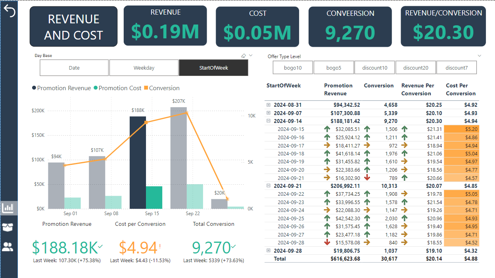

# Marketing Reward Program Analysis

## Project Background
A global chain of coffeehouses and roastery has run a marketing promotion for one month, which has significant amounts of data on its sales, marketing efforts, and loyalty program that has been previously underutilized. This project thoroughly analyzes and synthesizes this data to uncover critical insights that will improve the company reward program effectiveness.

Insights and recommendations are provided on the following key areas:
- **Sales Trends Analysis**: Evaluation of sales patterns, focusing on Promotional Revenue, Order Volume, Average Order Value (Revenue per conversion), and Cost.
- **Promotion Performance**: An analysis of the reward program's impact on customer retention and sales.
- **Customer Segmentation**: Understanding the impact of different demographics on sales and promotion campaigns.

An interactive PowerBI dashboard can be downloaded [here](https://github.com/kelvindinhq/reward_program_marketing_analytic/tree/main/dashboard).  
The SQL queries in SQL serverless Pool utilized to inspect and perform quality checks can be found [here](https://github.com/kelvindinhq/reward_program_marketing_analytic/tree/main/sqlscript).  
The PySpark commands in SQL Spark pool utilized to clean, organize, and prepare data for the dashboard can be found [here](https://github.com/kelvindinhq/reward_program_marketing_analytic/tree/main/notebook).  
The DAX queries and it's performance can be found [here](https://github.com/kelvindinhq/reward_program_marketing_analytic/blob/main/DAX%20queries/DAX_queries.csv)

## Data Structure and Initial Checks
The data structure to analyze the company reward program consists of four tables: customer profile, offer type, transaction, promotion status, and offer completed, with a total row count of 306,648 records.  

---

## Executive Summary

### Overview of Findings
During the promotion month, the company's sales from promotions gradually increased, with a significant rise in the third week of the period. Key performance indicators all showed week-over-week increases: promotion revenue by 76%, conversion went up 74%, while the cost maintained around $3 per conversion. While this increase can be broadly attributed to customer retention after the first two weeks, the following sections will explore additional contributing factors and highlight key areas for improvement.  

---

## Sales Trends

- The latter half of the promotion period saw a great increase in revenue, with week 3 sales of $188,181 and week 4 of $206,992 compared to the first week of $93,342. This corresponds to a lag in customer acceptance toward the promotion program.
- Conversions showed similar trends, doubling in the last two weeks to 10,313 weekly, compared to just half that figure at 4,658 in the first two weeks.  

- The company’s sales peaked on Sunday with $136,747 in promotional revenue and 6,389 conversions over 4 weeks but decreased sharply toward the end of the week, with a 40% drop in sales from Thursday and a 60% decrease on Saturday compared to Sunday.  

- The 10% discount was more widely accepted than the 20% discount, generating $161,247 in sales compared to $82,981 from the 20% discount.  

---

## Promotion Performance

- Conversion rates were around 40% for both the discount and BOGO (buy-one-get-one) promotion types. While engagement with a discount voucher was slightly lower than with a BOGO voucher (25K compared to 29K), the discount voucher drove more order volume (17K orders compared to 14K for BOGO).
- The cost of promotions varied greatly, with $2.87 per conversion for discounts and $7.24 for BOGO, while the average revenue per conversion remained the same at around $20.  

- Among the discount vouchers, discounts for order values at $10 were the most popular, with 8,569 conversions, while the $7 discount had the highest conversion rate at 52.76%. The $20 discount performed the lowest among the three discount categories.
- The conversion rate for BOGO offers was lower than for discount offers, despite a higher engagement rate (90% on average). BOGO offers at $5 had a more profound impact with a 47% conversion rate compared to only 37% for BOGO at $10.  

---

## Customer Segmentation

- The promotion sales were highest among customers aged 55-69, generating $230K in revenue, followed by those aged 40-54, contributing $160K. Female customers in the 55-69 age group contributed the highest sales to the program at $41,055, around 8% of total promotion revenue.

- Vouchers were most widely used by customers aged 55-69, but there is an emerging trend of voucher use among male customers aged 40-54 who became members more recently.

---

## Recommendations

1. **Optimize Promotion Timing and Focus on Weekends**
   - Sales peaked on Sundays with a sharp decline from Thursday to Saturday.
   - **Recommendation**: Introduce targeted promotions over weekends, especially on Sunday, to capitalize on peak customer engagement. Consider offering special weekend-only promotions or flash sales to boost Thursday-to-Saturday performance.

2. **Promote Discount Offers Over BOGO for Higher Conversion Rates**
   - Discount promotions resulted in more order volume and lower cost per conversion compared to BOGO offers.
   - **Recommendation**: Prioritize discount-based promotions, especially at the $10 threshold, where conversion rates are high and costs per conversion are lower. 

3. **Target High-Spending Customer Segments**
   - The age group 55-69 generated the highest promotion sales, particularly among female customers.
   - **Recommendation**: Tailor specific marketing messages and personalized offers for the 55-69 age group, especially female customers, while creating targeted campaigns for male customers aged 40-54.

4. **Reconsider Deep Discounts**
   - Discounts greater than 10% generated lower sales, with 10% discounts leading to better customer acceptance.
   - **Recommendation**: Limit deep discount promotions and focus more on 10% discounts, which have a higher acceptance rate. Reserve deep discounts for specific occasions or underperforming segments.

5. **Improve BOGO Offer Engagement**
   - Despite high engagement with BOGO offers, conversion rates were lower compared to discounts.
   - **Recommendation**: Refine BOGO offers by promoting lower price points (like $5) and adding more value through loyalty points or small discounts to increase attractiveness.

